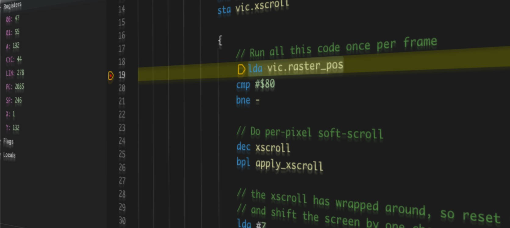

# IDE support

MOS provides a language server and debug adapter that can be used by IDEs to provide tooling.

It is used to provide a Visual Studio Code extension, and also [an Emacs package](https://github.com/themkat/mos-mode). The Emacs package provides the same features as the Visual Studio Code extension, and you can refer to the VSCode documentation for details.

